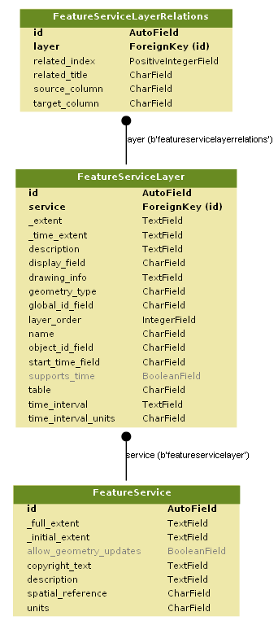

Tablo Data Model
================

The Tablo data model is structured around three tables, shown in the diagram below:

The main table, **FeatureService**, contains the information about the feature service itself, its capabilities, extents,
etc. The ID for the FeatureService will be used in any URLs used to reference the data.

The **FeatureServiceLayer** table associates an individual layer with a **FeatureService**. Currently, this is a one to one
relationship, but could be one to many in the future. The `table` property within the *FeatureServiceLayer* identifies
the table where this FeatureServiceLayer will retrieve it's data from.

The **FeatureServiceLayerRelations** table allows the association of related tables to the main layer table. Associated
data will be pulled from a table named with the same name as the **FeatureServiceLayer's** table, but with a suffix of
_{related_index}. So, if the original layer pulled data from a table called ``db_12345``, the first related table would
be called ``db_12345_0``.

Data Tables
-----------

Tables containing data can have any structure, but must contain the following a ``db_id`` field that is the primary key
for the table, and a ``dbasin_geom`` field that contains the geometry for the given row.

Related tables do not need these fields, but must have foreign keys that match the ``source_column``
and ``target_column`` in the FeatureServiceLayerRelations table.

